# Reflection Tree — Visual Diagram

```mermaid
flowchart TD
    START([START\nGood evening...]) --> A1_OPEN

    A1_OPEN[How would you describe today?] --> A1_OPEN_DECISION{ }

    A1_OPEN_DECISION -->|Productive / Mixed| A1_Q1_HIGH
    A1_OPEN_DECISION -->|Tough / Frustrating| A1_Q1_LOW

    A1_Q1_HIGH[What drove today's positive moments?] --> A1_Q1_HIGH_DECISION{ }
    A1_Q1_HIGH_DECISION -->|Planned / Adapted| A1_Q2_INTERNAL
    A1_Q1_HIGH_DECISION -->|People / Circumstances| A1_Q2_EXTERNAL

    A1_Q1_LOW[When something went wrong — what caused it?] --> A1_Q1_LOW_DECISION{ }
    A1_Q1_LOW_DECISION -->|Not prepared / Saw it coming| A1_Q2_INTERNAL
    A1_Q1_LOW_DECISION -->|Someone else / Circumstances| A1_Q2_EXTERNAL

    A1_Q2_INTERNAL[When there was a moment to step in — what did you do?] --> A1_Q2_INT_DECISION{ }
    A1_Q2_INT_DECISION -->|Made a call / Tried| A1_Q3_INTERNAL
    A1_Q2_INT_DECISION -->|Hesitated / Window closed| A1_Q3_MIXED

    A1_Q2_EXTERNAL[Looking back — did you have more influence than you felt?] --> A1_Q2_EXT_DECISION{ }
    A1_Q2_EXT_DECISION -->|Yes / Maybe| A1_Q3_MIXED
    A1_Q2_EXT_DECISION -->|No room / Out of hands| A1_Q3_EXTERNAL

    A1_Q3_INTERNAL[Looking at how you handled today — what does it tell you?] --> A1_R_VICTOR
    A1_Q3_MIXED[If you could replay one moment today — what would you change?] --> A1_R_MIXED
    A1_Q3_EXTERNAL[On days you feel most like yourself — what's different?] --> A1_R_VICTIM

    A1_R_VICTOR([Reflection: You stayed in the driver's seat...]) --> BRIDGE_1_2
    A1_R_MIXED([Reflection: You can see the moment now...]) --> BRIDGE_1_2
    A1_R_VICTIM([Reflection: Tough days make the walls feel closer...]) --> BRIDGE_1_2

    BRIDGE_1_2[/Shift: from how you handled things, to what you gave/] --> A2_OPEN

    A2_OPEN[Think of one interaction today. What was your role?] --> A2_OPEN_DECISION{ }
    A2_OPEN_DECISION -->|Helping / Own thing| A2_Q1_CONTRIB
    A2_OPEN_DECISION -->|Getting help / Waiting| A2_Q1_ENTITLE

    A2_Q1_CONTRIB[Did you do something today that wasn't expected of you?] --> A2_Q1_C_DECISION{ }
    A2_Q1_C_DECISION -->|Yes helped / Flagged / Stayed| A2_Q2_CONTRIB
    A2_Q1_C_DECISION -->|Stuck to my work| A2_Q2_NEUTRAL

    A2_Q1_ENTITLE[Did your effort feel seen today?] --> A2_Q1_E_DECISION{ }
    A2_Q1_E_DECISION -->|Unnoticed / Credit taken| A2_Q2_ENTITLE
    A2_Q1_E_DECISION -->|A little / Not really| A2_Q2_NEUTRAL

    A2_Q2_CONTRIB[When you helped today — what was driving it?] --> A2_Q2_C_DECISION{ }
    A2_Q2_C_DECISION -->|Right thing / Their struggle| A2_Q3_CONTRIB
    A2_Q2_C_DECISION -->|Reciprocal / Look good| A2_Q3_MIXED

    A2_Q2_ENTITLE[When you felt overlooked — what did you do with it?] --> A2_Q2_E_DECISION{ }
    A2_Q2_E_DECISION -->|Kept going / Mentioned it| A2_Q3_MIXED
    A2_Q2_E_DECISION -->|Pulled back / Stayed with me| A2_Q3_ENTITLE

    A2_Q2_NEUTRAL[If a colleague needed you outside your job — what would you do?] --> A2_Q2_N_DECISION{ }
    A2_Q2_N_DECISION -->|Helped / Would notice| A2_Q3_MIXED
    A2_Q2_N_DECISION -->|Depended / Redirected| A2_Q3_ENTITLE

    A2_Q3_CONTRIB[Did your presence shift anything for someone today?] --> A2_R_GIVER
    A2_Q3_MIXED[On a day you go home feeling good — what made it that way?] --> A2_R_MIXED
    A2_Q3_ENTITLE[What did you find yourself wanting more of today?] --> A2_R_TAKER

    A2_R_GIVER([Reflection: You gave today — not because someone was watching...]) --> BRIDGE_2_3
    A2_R_MIXED([Reflection: A mix today — some giving, some expecting...]) --> BRIDGE_2_3
    A2_R_TAKER([Reflection: Something feels off balance...]) --> BRIDGE_2_3

    BRIDGE_2_3[/Shift: from what you gave, to who you were thinking about/] --> A3_OPEN

    A3_OPEN[When you think about today's biggest challenge — who comes to mind?] --> A3_OPEN_DECISION{ }
    A3_OPEN_DECISION -->|Just me| A3_Q1_SELF
    A3_OPEN_DECISION -->|Team / Someone / People we serve| A3_Q1_OTHER

    A3_Q1_SELF[While dealing with your own stuff — did you notice anyone else?] --> A3_Q1_S_DECISION{ }
    A3_Q1_S_DECISION -->|Too focused / Too stretched| A3_Q2_SELF
    A3_Q1_S_DECISION -->|Noticed / Checked in| A3_Q2_EXPANDING

    A3_Q1_OTHER[When you thought about someone else — did it change what you did?] --> A3_Q1_O_DECISION{ }
    A3_Q1_O_DECISION -->|Different choices / Pushed harder / Added meaning| A3_Q2_OTHER
    A3_Q1_O_DECISION -->|Focused on my part| A3_Q2_EXPANDING

    A3_Q2_SELF[If a colleague had a rough day today — do you know?] --> A3_Q2_S_DECISION{ }
    A3_Q2_S_DECISION -->|No idea / Don't talk about it| A3_Q3_SELF
    A3_Q2_S_DECISION -->|Think so / Reached out| A3_Q3_EXPANDING

    A3_Q2_EXPANDING[Did you stop to see today from someone else's side?] --> A3_Q2_EX_DECISION{ }
    A3_Q2_EX_DECISION -->|Yes / Briefly| A3_Q3_EXPANDING
    A3_Q2_EX_DECISION -->|Outcomes only / No bandwidth| A3_Q3_SELF

    A3_Q2_OTHER[Who felt most real to you today?] --> A3_Q2_O_DECISION{ }
    A3_Q2_O_DECISION -->|Specific person / Team / End user| A3_Q3_OTHER
    A3_Q2_O_DECISION -->|Abstract| A3_Q3_EXPANDING

    A3_Q3_SELF[When you felt most alive at work — was someone else part of it?] --> A3_R_SELF
    A3_Q3_EXPANDING[If you'd looked up from your own day — what would you have seen?] --> A3_R_EXPANDING
    A3_Q3_OTHER[When you helped someone today — what did it do for you?] --> A3_R_ALTROCENTRIC

    A3_R_SELF([Reflection: Today was mostly about you...]) --> SUMMARY
    A3_R_EXPANDING([Reflection: You're starting to look up...]) --> SUMMARY
    A3_R_ALTROCENTRIC([Reflection: You thought beyond yourself today...]) --> SUMMARY

    SUMMARY[Summary: Axis 1 + Axis 2 + Axis 3 + Closing insight] --> END([END\nGet some rest. See you tomorrow.])

    style START fill:#1a2a26,stroke:#7eb8a4,color:#7eb8a4
    style END fill:#1a1a1a,stroke:#3d3a37,color:#7a7570
    style BRIDGE_1_2 fill:#1a1a1a,stroke:#3d3a37,color:#7a7570
    style BRIDGE_2_3 fill:#1a1a1a,stroke:#3d3a37,color:#7a7570
    style SUMMARY fill:#2a1a1a,stroke:#b87e7e,color:#b87e7e

    style A1_R_VICTOR fill:#1a2a26,stroke:#7eb8a4,color:#9acfbd
    style A1_R_MIXED fill:#1a2a26,stroke:#7eb8a4,color:#9acfbd
    style A1_R_VICTIM fill:#1a2a26,stroke:#7eb8a4,color:#9acfbd

    style A2_R_GIVER fill:#221a2a,stroke:#a07eb8,color:#c0a0d8
    style A2_R_MIXED fill:#221a2a,stroke:#a07eb8,color:#c0a0d8
    style A2_R_TAKER fill:#221a2a,stroke:#a07eb8,color:#c0a0d8

    style A3_R_SELF fill:#2a1a1a,stroke:#b87e7e,color:#d09090
    style A3_R_EXPANDING fill:#2a1a1a,stroke:#b87e7e,color:#d09090
    style A3_R_ALTROCENTRIC fill:#2a1a1a,stroke:#b87e7e,color:#d09090
```

---

## How to read this

- **Diamond shapes `{ }`** — decision nodes. Invisible to the user, route automatically based on the previous answer
- **Rectangles** — question nodes. Employee picks one option
- **Rounded rectangles `([ ])`** — start, end, and reflection nodes
- **Parallelograms `/  /`** — bridge nodes, auto-advance between axes
- **Teal nodes** — Axis 1 (Locus)
- **Purple nodes** — Axis 2 (Orientation)
- **Rose nodes** — Axis 3 (Radius)

## Possible paths

Every session takes one of **12 distinct paths** through the tree:

| Axis 1 | Axis 2 | Axis 3 |
|---|---|---|
| Victor | Giver | Altrocentric |
| Victor | Giver | Expanding |
| Victor | Mixed | Self |
| Mixed | Mixed | Expanding |
| Mixed | Taker | Self |
| Victim | Taker | Self |
| ... and so on |

Same answers always produce the same path. That's the design.